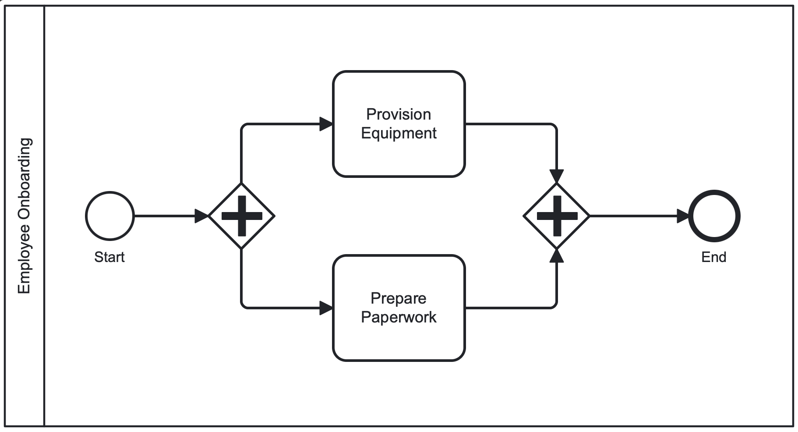

# employee_onboarding_workflow

### Handles the parallel preparation of equipment and paperwork for new employee onboarding.

---

Initial Scaffold generated with Dapr [Workflow Composer](https://workflows.diagrid.io) by [](https://diagrid.io)

_Version_: `development`

---

## 🧭 Workflow Diagram

[](EmployeeOnboardingWorkflow.png)


---

## 🚀 Choose Your Deployment Path

> 📋 **Quick Decision Guide**
> - **🌟 [Catalyst](https://www.diagrid.io/catalyst) (Recommended)**: Skip the fragmented libraries and infrastructure setup. Ready to go in under 60 seconds with fully managed, open-source Dapr. Focus on business logic, not boilerplate.
> - **🛠️ Local Development**: Choose this for offline development, learning Dapr internals, or when you need full infrastructure control.
>
> **New to Dapr Workflows?** → Start with **[Catalyst](https://www.diagrid.io/catalyst)** - no ops required  
> **Building for production?** → **[Catalyst](https://www.diagrid.io/catalyst)** provides fault-tolerant, durable execution  
> **Learning or customizing?** → **Local Dapr** gives you full control and insight

<details>
<summary><strong>☁️ Diagrid Catalyst</strong> (Cloud-Managed Dapr)</summary>

👉 Learn more at [diagrid.io/catalyst](https://www.diagrid.io/catalyst)


### Prerequisites
- [Python 3.9 or later](https://www.python.org/downloads/)
- [Diagrid account](https://catalyst.diagrid.io) (free tier available)
- [Diagrid CLI](https://docs.diagrid.io/catalyst/references/cli-reference/intro/) version 0.386.0 or later
- (Optional but recommended) [uv](https://github.com/astral-sh/uv) - A modern Python package manager

### Setup Steps

#### 1. Verify Diagrid CLI Installation
```bash
# Check Diagrid CLI version
diagrid version
```
Make sure the CLI version is 0.386.0 or later.

#### 2. Setup Environment and Dependencies

**Using uv (recommended):**
```bash
# Create and activate virtual environment
uv venv venv
. venv/bin/activate  # On Windows: venv\Scripts\activate

# Install dependencies
uv pip install -r requirements.txt
uv pip install -e .
```

**Using pip:**
```bash
# Create and activate virtual environment
python3 -m venv venv
. venv/bin/activate  # On Windows: venv\Scripts\activate

# Install dependencies
pip install -r requirements.txt
pip install -e .
```

#### 3. Start the Application
> 💡 **Tip**: The Diagrid CLI provisions all required infrastructure—actor state store, Dapr sidecars, and more—into a serverless [Catalyst](https://www.diagrid.io/catalyst) environment. No ops required!

```bash
# Start with cloud-managed Dapr infrastructure
diagrid dev run -f dapr.yaml --project python-wf-app
```

#### 4. Configure Environment (in a new terminal)
```bash
# Set the Dapr host address for cloud endpoint
export DAPR_HOST_ENDPOINT=`diagrid project get python-wf-app -o json | grep '"http"' -A 2 | grep '"url"' | cut -d '"' -f 4`
```

```powershell
# On Windows PowerShell:
$env:DAPR_HOST_ENDPOINT = "$(diagrid project get --project python-wf-app -o json | ConvertFrom-Json | Select-Object -ExpandProperty status | Select-Object -ExpandProperty endpoints | Select-Object -ExpandProperty http | Select-Object -ExpandProperty url)"
```

#### 5. Start a Workflow
```bash
# Wait a moment for the application to start, then:
curl -X POST ${DAPR_HOST_ENDPOINT}:3984/v1.0/workflows/dapr/build_pipeline_workflow/start \
   -H "Content-Type: application/json" \
   -d '{"data": {"unit_tests_required": true}}'
```

```powershell
Invoke-WebRequest -Method POST -Uri $Env:DAPR_HOST_ENDPOINT:3984/v1.0/workflows/dapr/build_pipeline_workflow/start `
  -ContentType "application/json" `
  -Body '{"data":{"unit_tests_required": true}}'
```

#### 6. Check Workflow Status
```bash
# Replace <instance-id> with the ID returned from the start command
curl -s ${DAPR_HOST_ENDPOINT}:3984/v1.0/workflows/dapr/<instance-id>
```

```powershell
Invoke-WebRequest -Uri $Env:DAPR_HOST_ENDPOINT:3984/v1.0/workflows/dapr/<instance-id>
```

</details>

<details>
<summary><strong>🏠 Local Dapr Development</strong></summary>

### Prerequisites
- [Python 3.9 or later](https://www.python.org/downloads/)
- [Dapr CLI](https://docs.dapr.io/getting-started/install-dapr-cli/) version 1.15 or later
- [Docker](https://www.docker.com/products/docker-desktop) (for running Dapr components)
- (Optional but recommended) [uv](https://github.com/astral-sh/uv) - A modern Python package manager

### Setup Steps

#### 1. Verify Dapr Installation
```bash
# Check Dapr version
dapr --version
```
Make sure the version is 1.15 or later for CLI and Runtime.

If you haven't initialized Dapr before:
```bash
dapr init
```

#### 2. Setup Environment and Dependencies

**Using uv (recommended):**
```bash
# Create and activate virtual environment
uv venv venv
. venv/bin/activate  # On Windows: venv\Scripts\activate

# Install dependencies
uv pip install -r requirements.txt
uv pip install -e .
```

**Using pip:**
```bash
# Create and activate virtual environment
python3 -m venv venv
. venv/bin/activate  # On Windows: venv\Scripts\activate

# Install dependencies
pip install -r requirements.txt
pip install -e .
```

#### 3. Start the Application
```bash
# Start all apps defined in dapr.yaml
dapr run -f .
```

#### 4. Configure Environment (in a new terminal)
```bash
# Set the Dapr host address
export DAPR_HOST_ENDPOINT=http://localhost
```

```powershell
# On Windows PowerShell:
$env:DAPR_HOST_ENDPOINT = "http://localhost"
```

#### 5. Start a Workflow
```bash
# Wait a moment for the application to start, then:
curl -X POST ${DAPR_HOST_ENDPOINT}:3984/v1.0/workflows/dapr/build_pipeline_workflow/start \
   -H "Content-Type: application/json" \
   -d '{"data": {"unit_tests_required": true}}'
```

```powershell
Invoke-WebRequest -Method POST -Uri $Env:DAPR_HOST_ENDPOINT:3984/v1.0/workflows/dapr/build_pipeline_workflow/start `
  -ContentType "application/json" `
  -Body '{"data":{"unit_tests_required": true}}'
```

#### 6. Check Workflow Status
```bash
# Replace <instance-id> with the ID returned from the start command
curl -s ${DAPR_HOST_ENDPOINT}:3984/v1.0/workflows/dapr/<instance-id>
```

```powershell
Invoke-WebRequest -Uri $Env:DAPR_HOST_ENDPOINT:3984/v1.0/workflows/dapr/<instance-id>
```

</details>

---

## Detailed Documentation

## Overview

This application implements a Dapr workflow using Python and the Dapr workflow SDK. It demonstrates how to:

- Define a workflow using the Dapr Workflow SDK
- Use a unified data model for workflow state
- Handle conditions and branching
- Expose a REST API for workflow management

## Workflow Determinism

Any non-deterministic code should go into activities. This includes, calling other (Dapr) services, state stores, pub/sub systems, and external endpoints. The workflow should only be responsible for the business logic that defines the sequence of the activities.

The Dapr workflow engine replays workflows multiple times during execution, so workflow code must behave consistently on each replay. Activities are the appropriate place for operations with side effects or external dependencies.

## Data Flow Architecture

The workflow uses a simple `WorkflowData` class to manage state throughout the entire execution.
It keeps track of activity history and allows for easy access to the data needed for the next activity.

If you start the process with the environment variable `DEBUG=true`, it will keep a history of all the activities and their results.
This is useful for debugging and understanding the flow of data through the workflow.

### Decision Points Reference

This workflow contains several decision points that determine the flow of execution.

You can customize by setting specific values in the `WorkflowData`.

Decision points are in most cases mutually exclusive - only one should be set to `true`.
| Example Condition | `is_approved` | `data.set_value("is_approved", True)` |
| Example Validation | `is_valid` | `data.set_value("is_valid", check_validity(data))` |

### Benefits and Limitations of the Data Model

#### Benefits for Getting Started:
1. **Simplified Data Flow**: A single object flows through the workflow, making it easy to trace data.
2. **Dynamic Properties**: Using `get_value()` and `set_value()` methods allows flexible data storage without defining many classes.
3. **Easy Parallel Handling**: A unified structure simplifies merging results from parallel branches.
4. **Minimal Code Generation**: Reduces the need to generate many specialized classes.

#### Limitations for Production Use:
1. **Limited Type Safety**: Using string keys with dynamic data reduces type checking.
2. **No Schema Validation**: No built-in validation for required properties or data formats.
3. **Reduced Readability**: Less clarity about what data each activity actually needs.
4. **Performance Overhead**: Dynamic serialization/deserialization has some overhead.

For production systems, consider evolving toward domain-specific models that better represent your business entities.

#### Tips for Effective Data Handling

1. **Use Python idioms**: Follow Python naming conventions (snake_case) for all fields
2. **Consider input validation**: Validate data before passing it to activities
3. **Leverage immutability**: Use copy methods to avoid modifying the original data
4. **Add structured logging**: Use Python's logging module with appropriate context for better debugging

## Customization Guidelines

### Adapting the Unified Data Model

The generated workflow uses a simplified approach with a single `WorkflowData` class that flows through all activities. While this is convenient for getting started, you may want to adapt it for real-world scenarios:

1. **Domain-Specific Models**: Replace the generic `WorkflowData` with your domain entities
   ```python
   @dataclass
   class OrderProcessing:
       input: OrderRequest
       result: OrderResult
   ```

2. **Activity-Specific Types**: Define input/output types for each activity
   ```python
   @wfr.activity
   def verify_inventory_activity(ctx, input: InventoryRequest) -> InventoryResult:
       # Extract what this activity needs
       product_id = input.product_id
       if not product_id:
           raise ValueError("Missing required field: product_id")

       # Business logic here
       # ...

       return result
   ```

3. **Custom Business Logic**: Replace the generic activity implementations with your actual business logic
   ```python
   # Instead of:
   if data.get_bool("has_inventory")
   
   # Use domain-specific logic:
   has_stock = await inventory_service.has_sufficient_stock(
       order_details.product_id, 
       order_details.quantity
   )
   if has_stock:
       # Process order
   ```

### Conditional Logic Improvements

The generated workflow uses simple boolean conditions via `get_bool()` for simplicity. In production code:

1. Replace these with proper domain logic
2. Use strongly-typed properties instead of the dynamic dictionary
3. Add validation and error handling for conditional flows

Example transformation:
```python
# Generated code:
if data.get_bool("is_approved")

# Production code:
approved = await approval_service.validate_approval(
   request.order_id,
   workflow_execution.instance_id
)
if approved:
# Handle approval logic
```

### Handling Complexity

For more complex workflows:

1. Break large workflows into smaller sub-workflows
2. Add robust error handling and compensation logic
3. Implement observability through structured logging and metrics
4. Consider versioning strategies for long-running workflows

## Project Structure

```
.
├── 🛠 pyproject.toml        # Python project metadata and dependencies
├── 📄 README.md             # This documentation file
├── 🧩 components/           # Dapr component configurations
│   ├── pubsub.yaml          # Message broker/pub-sub component
│   └── statestore.yaml      # State store component
├── 🖥️ src/                  # Source code directory
│   ├── __init__.py          # Makes the directory a Python package
│   ├── app.py               # Application entry point
│   └── workflow/            # Workflow-related code
│       ├── __init__.py      # Makes workflow a Python package
│       ├── activities.py    # Individual workflow activities/tasks
│       ├── models.py        # Data models for workflow state
│       ├── runtime.py       # Workflow runtime configuration
│       └── workflow.py      # Main workflow orchestration
├── 📝 requirements.txt      # Python dependencies list
└── 🐳 Dockerfile            # Container definition
```

---

Initial Scaffold generated with Dapr [Workflow Composer](https://workflows.diagrid.io) by [](https://diagrid.io)

_Version_: `development`